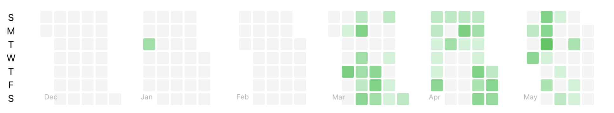
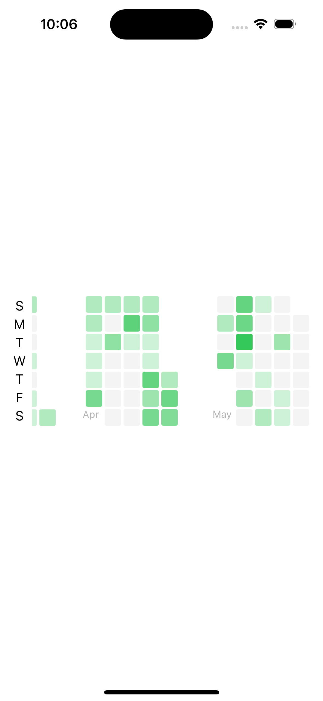
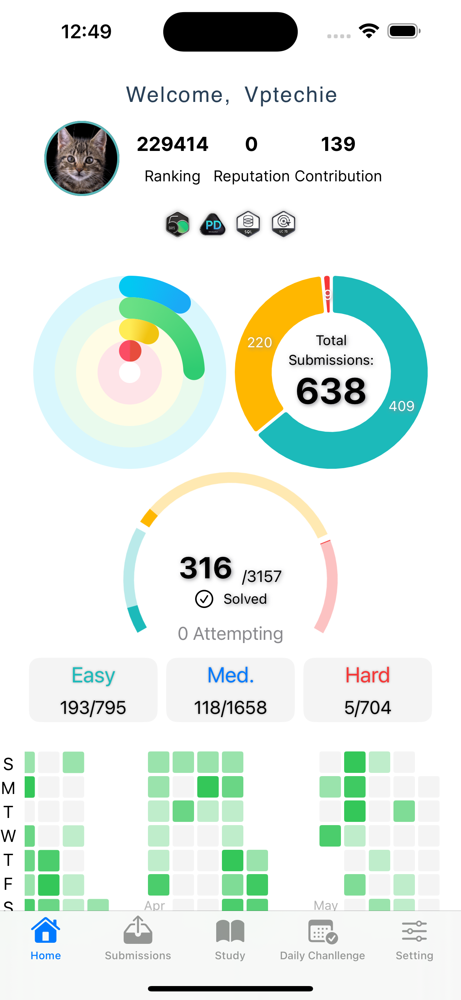

# Contribution Graph in SwiftUI
I've been searching for a lightweight and customizable contribution graph in SwiftUI, but none of the options I found met my needs. To address this, I created my own solution and am sharing the code for anyone who might find it useful.

## Features

- Multi-Month Display: View the calendar in a horizontal layout, displaying up to 12 months by default.
- Customizable Appearance: Tailor the calendar's look to resemble popular styles such as Leetcode or GitHub.
- Multi-Date Selection: Easily select multiple dates within the calendar.
- Event Handling & Customization: Integrate and customize event handling to suit your application's requirements.
- Log Scale Color: Utilize log scale color coding for enhanced visual representation of data.
- No Third-Party Libraries: Implement this graph without relying on external libraries.

## Requirements

- iOS 13.0+
- Xcode 11.0+
- Swift 5.0+

## Installation

1. Clone the repository.
2. Open the project in Xcode.
3. Build and run.

## Usage

This visualisation can be used in your dashboard or heatmap calendar for analytics

## Contributing

Contributions are welcome! 

## License

This project is licensed under the MIT License. See the [LICENSE](LICENSE) file for more information.
